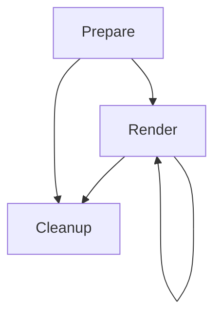
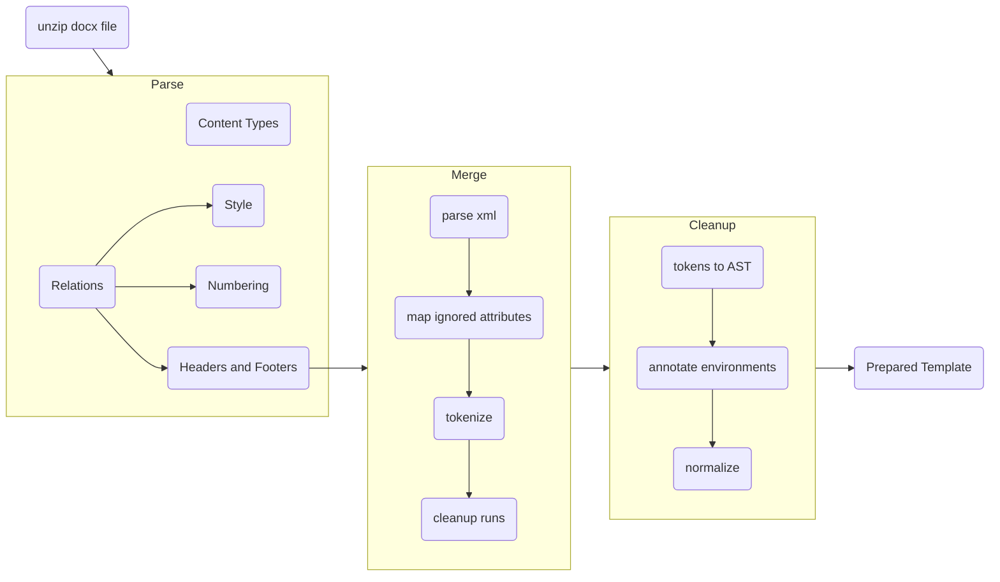

# Architecture

The lifecycle of a template (fragment or document) consists of three stages:

## Prepare

Preparing a `docx` template file starts with uncompressing it's content into a temporary directory. Then, we need to parse the uncompressed files.

- The `Content_Types.xml` describes the types of the files in the archive.
- The default relations file is in `_rels/.rels` and it describes the structure of the template file. It points to the main document xml file.
- Then each document xml file may have its own relation file, which can be found by the naming convention. The `word/document.xml` file has the relations stored in `word/documents.xml.rels` file.
- These relation files point to other parts of the template: style definition files, numbering definitions, headers and footers.
- Header and footer files are just like our main document xml file so we continue parsing the template recursively there.

### Merge and Cleanup steps

TODO!

### Rendering

TODO!

### Cleanup step

When a prepared template is cleaned up, the allocated resources are freed, such as:
- The temporary files that were created when uncompressing the template file in the first step.
- Any associated in-memory buffers.

Finally, the template object in the memory is marked as cleaned up to prevent accidentally rendering it again and producing incomplete documents.
