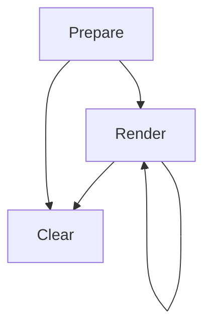
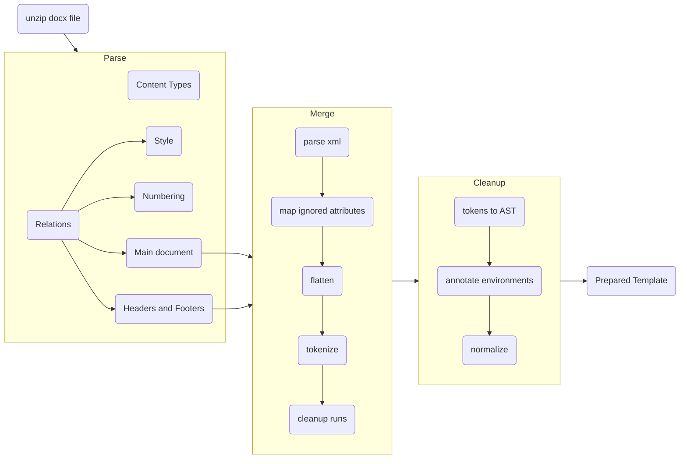
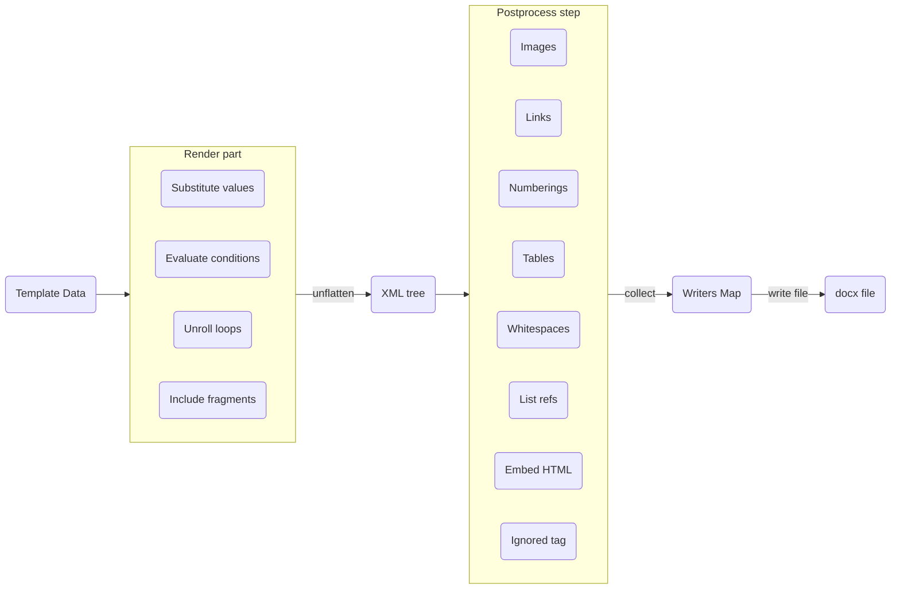

# Architecture

The lifecycle of a template (fragment or document) consists of three stages:

## Prepare

Preparing a `docx` template file starts with uncompressing it's content into a temporary directory. Then, we need to parse the uncompressed files.

- The `Content_Types.xml` describes the types of the files in the archive.
- The default relations file is in `_rels/.rels` and it describes the structure of the template file. It points to the main document xml file.
- Then each document xml file may have its own relation file, which can be found by the naming convention. The `word/document.xml` file has the relations stored in `word/documents.xml.rels` file.
- These relation files point to other parts of the template: style definition files, numbering definitions, headers and footers.
- Header and footer files are just like our main document xml file so we continue parsing the template recursively there.

### Merge and Cleanup steps

The central idea of Stencil is an algorithm to make sure that templating expressions embedded in an OOXML document can be evaluated while the semantic correctness of the document is maintained.

## Rendering

TODO!

## Clearing step

When a prepared template is cleared, the allocated resources are freed, such as:
- The temporary files that were created when uncompressing the template file in the first step.
- Any associated in-memory buffers.

Finally, the template object in the memory is marked as cleaned up to prevent accidentally rendering it again and producing incomplete documents.

A Read-Write lock is used to make sure that it is not possible to clear up a template that is still being rendered. Also, it is not possible to render a template that has already been cleared up, and an exception is thrown when tried.
