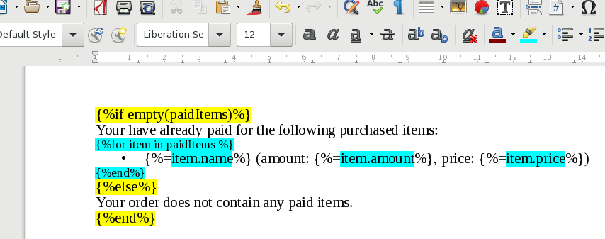

# Functions

You can call functions from within the template files and embed the call result easily by writing
<code>{<i>%=functionName(arg1, arg2, arg3, ...)%</i>}</code> expression in the document template.

This is a short description of the functions implemented in Stencil:

- [ceil](#ceil)
- [coalesce](#coalesce)
- `currency`
- [date](#date)
- [empty](#empty)
- [floor](#floor)
- [format](#format)
- `hideColumn`
- `hideRow`
- [html](#html)
- [join](#join)
- [length](#length)
- [lowercase](#lowercase)
- `percent`
- `range`
- [round](#round)
- [str](#str)
- `switch`
- `titlecase`
- `uppercase`
- [xml](#xml)
- [contains](#contains)
- [sum](#sum)

## Basic Functions

### Coalesce

Accepts any number of arguments, returns the first not-empty value.

**Exampe:**

- to insert the first filled name value: <code>{<i>%=coalesce(partnerFullName, partnerShortName, partnerName)%</i>}</code>
- to insert the price of an item or default to zero: <code>{<i>%=coalesce(x.price, x.premium, 0)%</i>}</code>

### Empty

Decides if a parameter is empty or missing. Useful in conditional statements.

**Example:**

<code>{<i>%if empty(userName) %</i>}Unknown User{<i>%else%</i>}{<i>%=userName%</i>}{<i>%end%</i>}</code>

If the value of `userName` is missing then `Unknown User` will be inserted, otherwise the value is used.

The `empty()` function is useful when we want to either enumerate the contents
of an array or hide the whole paragraph when the array is empty.

## String functions

These functions deal with textual data.

### Join

Joins a list of items with an optional separator.

**Example:** call join(xs, ",") to join them with a comma.

**Example:** call join(xs) to just concatenate the items.

### Date

Formats a date value according to a given [format string](https://docs.oracle.com/javase/6/docs/api/java/text/SimpleDateFormat.html).

Arguments:

1. First argument is a format string.
2. Second argument is a string containing a date value.

**Example:**

This example formats the value of `partner.birthDate` as a date string: <code>{<i>%=date("yyyy-MM-dd", partner.birthDate) %</i>}</code>

Also, try these formats strings:

- `"yyyy-MM-dd HH:mm:ss"` for example: `2018-02-28 13:01:31`
- `"EEE, dd MMM yyyy HH:mm:ss zzz"` (also known as RFC1123)
- `"EEEE, dd-MMM-yy HH:mm:ss zzz"` (a.k.a. RFC1036)
- `"EEE MMM d HH:mm:ss yyyy"` (ASCTIME)
- `"yyyy-MM-dd'T'HH:mm:ss.SSSXXX"` (ISO8601)

### HTML

It is possible to embed text with basic dynamic formatting using HTML notation. The HTML code will be converted to OOXML and inserted in the document.

Stencil uses a simple parsing algorithm to convert between the formats. At the moment only a limited set of basic formatting is implemented. You can use the following HTML tags:

- `b`, `em`, `strong` for bold text.
- `i` for italics.
- `u` for underlined text.
- `s` for strikethrough text.
- `sup` for superscript and `sub` for subscript.
- `span` elements have no effects.
- `br` tags can be used to insert line breaks.

The rendering throws an exception on invalid HTML input or unexpected HTML tags.

**Example:**

Write the following to embed the content of `x` as HTML in the document:
- <code>{<i>%=html(x) %</i>}</code>.

### XML

You can embed custom xml fragments in the document with the `xml()` function. The parameter is a string containing the XML nodes to insert.

### Format

Calls [String.format](https://docs.oracle.com/javase/7/docs/api/java/util/Formatter.html) function.

**Example:**

This example formats the value of `price` as a price string:
<code>{<i>%=format("$ %(,.2f"", price) %</i>}</code>. It may output `$ (6,217.58)`.

### Length

The `length(x)` function returns the length of the value in `x`:

- Returns the number of characters when `x` is a string.
- Returns the number of elements the `x` is a list/array.
- Returns the number of key/value pairs when `x` is an object/map.

Returns zero when `x` is `null`.

### Lowercase

The `lowercase(x)` function turns its string argument into a lowercase string. For example: `lowercase("HELLO")` returns `"hello"`.

### Str

The `str(x)` functions convers its non-null arguments into a string. Returns an empty string when all arguments are null. 

## Numeric functions

### Round

Expects one number argument. Rounds the argument to the closest integer. Usage: `round(x)`. For example `round(1.1)` returns `1`.

### Floor

Expects one number argument. Rounds the argument to the closest integer that is not greater than than the argument. Usage: `floor(x)`

### Ceil

Expects one number argument. Rounds its argument to the closest integer that is not smaller than the argument. Usage: `ceil(x)`

### Contains

Expects two arguments: a value and a list. Checks if list contains the value. Usage: `contains("myValue", myList)`

### Sum

Expects one number argument containing a list with numbers. Sums up the numbers and returns result. Usage: `sum(myList)`
