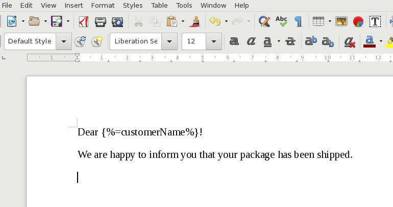
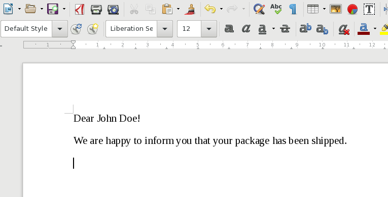
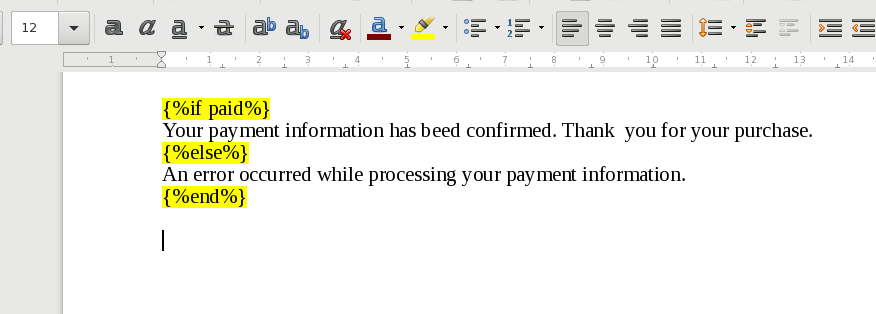

# Template file syntax

In Stencil your template files are DOCX documents. Therefore, you can edit the
templates in any word processing software, like LibreOffice.

This is a quick introduction to the syntax of the language used by Stencil.

## Substitution

Syntax: <code>{<i>%=EXPRESSION%</i>}</code>

You can use this form to embed textual value in your template. The `EXPRESSION`
part can be a variable name, function calls or a more complex mathematical expression.

**Examples:**

1. Insert the value of the `partnerName` key: <code>{<i>%=partnerName%</i>}</code>
2. Insert the circumference of a circle with radius under the `r` key: <code>{<i>%= r * 3.1415 * 2%</i>}</code>

So you can write this in a template file:

After applying Stencil with input data `{"customerName": "John Doe"}` you get this document:

## Control structures

You can embed control structures in your templates to implement advanced
templating logic. You can use it to repeatedly display segments or conditionally
hide parts of the document.

### Conditional display

This lets you conditionally hide or show parts of your document.

Syntax:

- <code>{<i>%if CONDITION%</i>}</code>THEN<code>{<i>%end%</i>}</code>
- <code>{<i>%if CONDITION%</i>}</code>THEN<code>{<i>%else%</i>}</code>ELSE<code>{<i>%end%</i>}</code>

Here the `THEN` part is only shown when the `CONDITION` part is evaluated to a
true value. Otherwise the `ELSE` part is shown (when specified).

- True values: everything except for `false` and `null`. Even an empty string or
an empty array are true too!
- False values: only `false` and `null`.

Example:

- <code>{<i>%if x.coverData.coverType == "LIFE"%</i>}</code>*Life insurance*<code>{<i>%else%</i>}</code>**Unknown**<code>{<i>%end%</i>}</code>

In this example the text `Life insurance` is shown when the value
of `x.coverData.coverType` is equal to the `"LIFE"` string.

You can also set a highlight color for the control markers. They markers will be
hidden after evaluating the template document, however, they make easier to
maintain the template file. Color coding the matching `if` and `else` pairs
also make it easier to understand a template if it gets complicated.

#### Elseif

Elseif, as its name suggests, is a combination of `else` and `if`. Instead of nesting `if` expresisons
in `else` branches, you can simply write an `elseif` expression and close it with one `end`.

For example:

<pre>{<i>% if CONDITION1 %</i>} THEN do this
{<i>% else if CONDITION2 %</i>} Or do this
{<i>% else %</i>} Or if none of the conditions matched, do this.
{<i>% end %</i>}</pre>

There are multiple supported syntaxes: `else if`, `elseif`, `elsif`, `elif`.

#### Reverted conditionals

Sometimes it makes sense to swap the THEN and ELSE branches to make the expression more readable.
You can write `unless` instead of `if !` (if-not) to express the negation of the condition.

For example, <code>{<i>%unless CONDITION%</i>} Apples {<i>%else%</i>} Oranges {<i>%end%</i>}</code> is the same as <code>{<i>%if ! CONDITION%</i>} Oranges {<i>%else%</i>} Apples {<i>%end%</i>}</code>.

You should also write unless if you would write `if !` but witout an `ELSE` part.

For example, <code>{<i>%unless CONDITION%</i>} Apples {<i>%end%</i>}</code> is the same as <code>{<i>%if ! CONDITION%</i>} Apples {<i>%end%</i>}</code> but easier to read.

### Iteration

You can iterate over the elements of a list to repeatedly embed content in your
document. The body part of the iteration is inserted for each item of the list.

Syntax:

- <code>{<i>%for x in elements %</i>}BODY{<i>%end%</i>}</code>

In this example we iterate over the contents of the `elements` array.
The text `BODY` is inserted for every element.

## Finding errors

- Check that every control structure is properly closed!
- Check that the control code does not contain any unexpected whitespaces.
